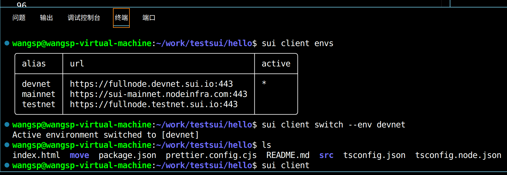
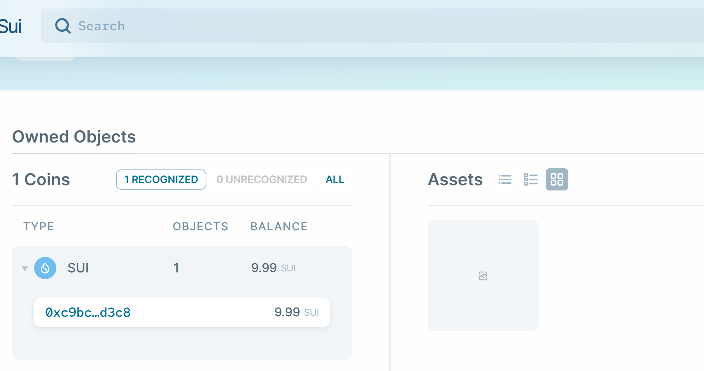
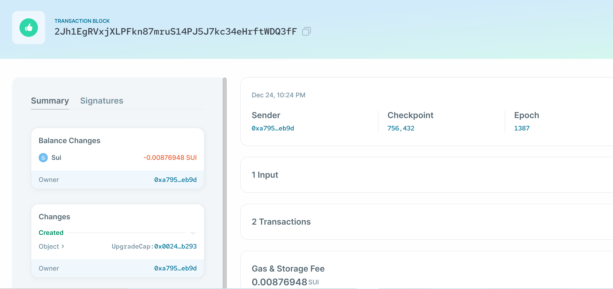
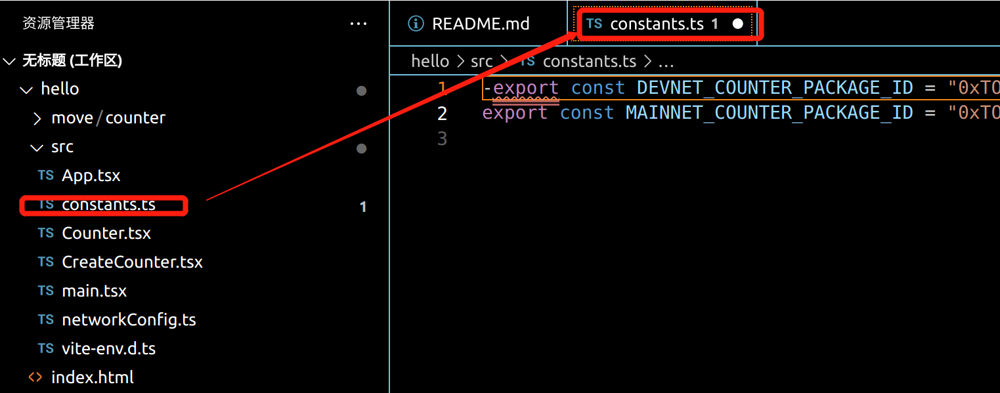

# 学习日志

# Roadmap 1

## 1.安装

### 安装Sui命令行

我尝试了win wsl不好用，干脆 linux 20.04的ubuntu

- 按照Rust官网  [sui-install](https://docs.sui.io/guides/developer/getting-started/sui-install) 的内容
```shell
$ curl --proto '=https' --tlsv1.2 -sSf https://sh.rustup.rs | sh
$ rustup update stable

# 检验 binaries 是否安装成功:
$ sui --version

$ cargo install --locked --git https://github.com/MystenLabs/sui.git --branch testnet sui

$ rustup update stable

$ cargo install --locked --git https://github.com/MystenLabs/sui.git --branch devnet sui
```

> 此处要开clash梯子，不然会下载失败，花了好长时间，我晚上2点才睡


## 2. Sui CLI 基础用法
### 使用
按照Rust官网  [cli使用](https://docs.sui.io/references/cli/client) 的内容。
- 列出当前所有网络别名:

~~~
$ sui client envs
~~~

>启动 sui client 在上述的命令运行结束之后, 会安装好 sui / sui client 以及其他的一些 binary, 直接运行 sui client, 在 terminal 

>会输出如下的提示信息
Press y and then press Enter
Config file ["/home/wangsp/.sui/sui_config/client.yaml"] doesn't exist, do you want to connect to a Sui Full node server [y/N]?y
Sui Full node server URL (Defaults to Sui Devnet if not specified) :

> 选0

Select key scheme to generate keypair (0 for ed25519, 1 for secp256k1, 2: for secp256r1):

>生成了地址
Generated new keypair and alias for address with scheme "ed25519" [charming-corundum: 0xa7957c348f7e66e0f10a2e9d5023fa5fe2a995bb7d0b7fef06195d81bdc2eb9d]

### 常用命令
- 生成 address
~~~
$ sui client new-address ed25519
~~~
- 查看地址
~~~
$ sui client addresses
~~~
- 列出所拥有的 gas objects
~~~
$ sui client gas
No gas coins are owned by this address
~~~
- 用于获取到私钥的加密版本
$ sui keytool list
~~~
$ sui keytool list
~~~

- 配置和切换网络
~~~
$ sui client new-env --alias 'mainnet' --rpc 'https://sui-mainnet.nodeinfra.com:443'

$ sui client new-env --alias 'testnet' --rpc 'https://fullnode.testnet.sui.io:443'

$ sui client switch --envs testnet

~~~
###  获得测试网 Testnet 的 Sui Tokens
> 下面的代码获取gas成功
~~~
curl --location --request POST 'https://faucet.devnet.sui.io/gas' \
--header 'Content-Type: application/json' \
--data-raw '{
    "FixedAmountRequest": {
        "recipient": "0xa7957c348f7e66e0f10a2e9d5023fa5fe2a995bb7d0b7fef06195d81bdc2eb9d"
    }
}'
~~~
> 列出 gas余额
$ sui client gas

## 3.安装sui wallet
> google extension安装使用私钥导入完成

## 4.GITHUB仓库克隆
### a. 秘钥生成
- 生成SSH密钥对：
 首先，在您的计算机上生成SSH密钥对（公钥和私钥）。您可以使用以下命令在终端或命令行中生成SSH密钥对（请替换 <your_email> 为您的电子邮件地址）：
~~~
$ ssh-keygen -t rsa -b 4096 -C "XXXXXX@qq.com"
~~~
- 这将生成一对SSH密钥，通常存储在 ~/.ssh/ 目录下。默认情况下，生成的文件是 id_rsa（私钥）和 id_rsa.pub（公钥）。
- 查看公钥：
~~~
$ cat ~/.ssh/id_rsa.pub
~~~
- 复制公钥：
复制公钥的内容，以备将其添加到GitHub账户。

> 添加公钥到GitHub账户：
点击 "Add SSH key"（添加SSH密钥）按钮。

- 登录到您的GitHub账户。
- 点击右上角的头像，然后选择 "Settings"（设置）。
- 在左侧导航栏中，选择 "SSH and GPG keys"（SSH和GPG密钥）。
- 点击 "New SSH key"（新建SSH密钥）。
- 在 "Title"（标题）字段中，为SSH密钥取一个描述性的标题，以便识别。
- 在 "Title"（标题）字段中，为SSH密钥取一个描述性的标题，以便识别。
- 在 "Key"（密钥）字段中，粘贴您之前复制的公钥内容。

### b. 开始克隆
- 验证SSH Key：
您可以通过运行以下命令来验证SSH Key是否正常工作：
~~~
$ ssh -T git@github.com
~~~
- 下面开始导入
~~~
git clone git@github.com:ILFISHDEER/SuiStartrek.git
~~~

## 前端方向的 Hello world
### 安装node js
- 此处我遇到版本低，于是安装node js 花了一些时间，官网下载到本地
[node js](https://nodejs.org/en)
- 解压缩文件
~~~
$ tar -xvf node-v20.10.0-linux-x64.tar.xz
~~~
- 移动Node.js目录
~~~
$ sudo mv node-v20.10.0-linux-x64 /usr/local/
~~~
- 更新你的PATH环境变量
~~~
$ nano ~/.bashrc
# 文件底部加
$ export PATH=/usr/local/node-v20.10.0-linux-x64/bin:$PATH

# 保存并关闭文件，然后运行以下命令使改变立即生效：
source ~/.bashrc

node -v
~~~
> 现在终于可以了
- 安装 npmp
~~~
sudo npm install -g pnpm
~~~

### 开始实操
- create a new dApp project.
[create-dapp](https://sdk.mystenlabs.com/dapp-kit/create-dapp)
~~~
$ pnpm create @mysten/dapp
~~~
- 选择 e2e这个

- 然后


- 建立好hello以后用vs打开，在hello下运行

- 参考 readme 的文件步骤，基本的操作我上面已经记录

- cd move 后运行如下代码，因为是把sui的代码库刷新一遍，所以很慢需要等待
~~~
$ sui client publish --gas-budget 100000000 counter
~~~
- 我的合约已经发布[sui区块链游览器](https://suiexplorer.com/)

- 复制交易记录已经可以看到这笔交易记录Transaction Digest: 2Jh1EgRVxjXLPFkn87mruS14PJ5J7kc34eHrftWDQ3fF

- 这就是刚才发布的合约


- 然后上链了需要前端代码交互，这里有教如何运行


- package id拿到，0x7511f371dcec74afd46418d87bcc1f8548dcf6611dc87af8836138313adf1446
- 然后修改src文件夹的constants.ts

- 然后修改这部分export const DEVNET_COUNTER_PACKAGE_ID = "<YOUR_PACKAGE_ID>"

> 这样前端和合约关联了

- 安装依赖
~~~
pnpm install
~~~
To start your dApp in development mode run
```bash
pnpm dev
```
- 连接成功

- ctrl+D结束


