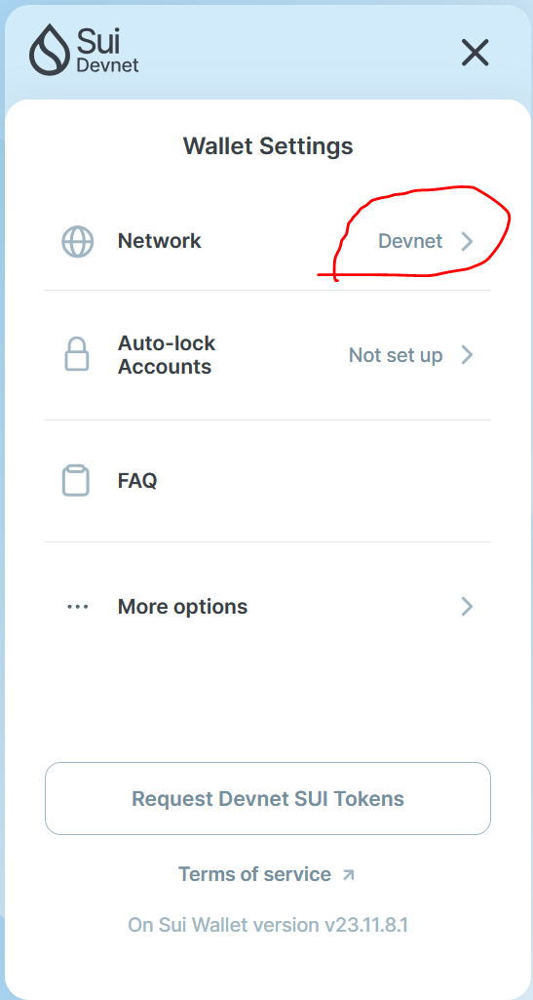
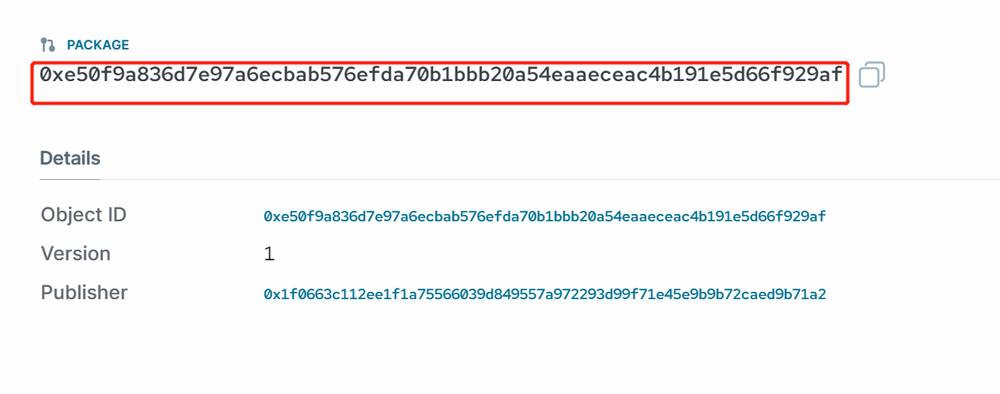
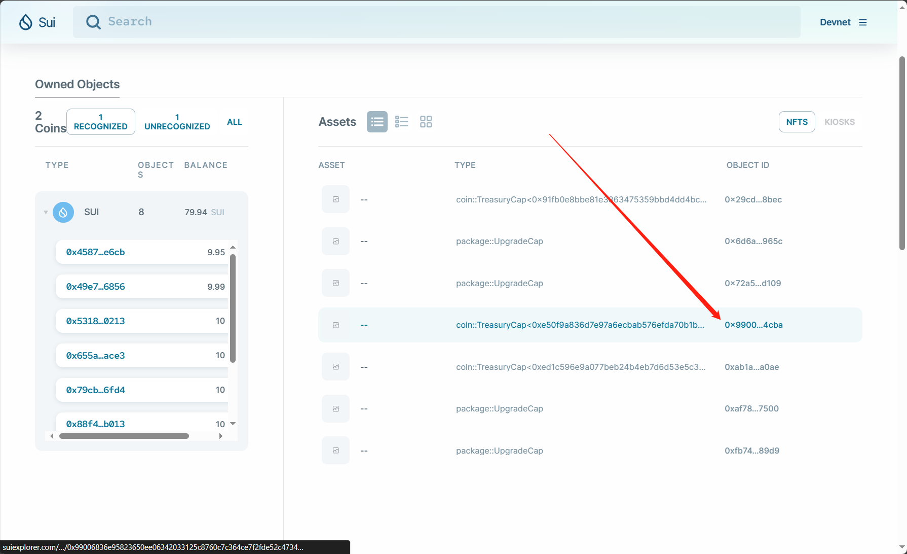
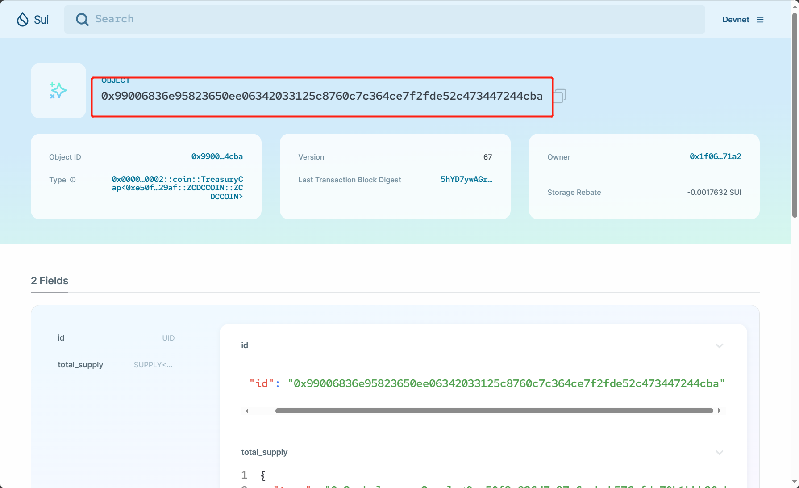
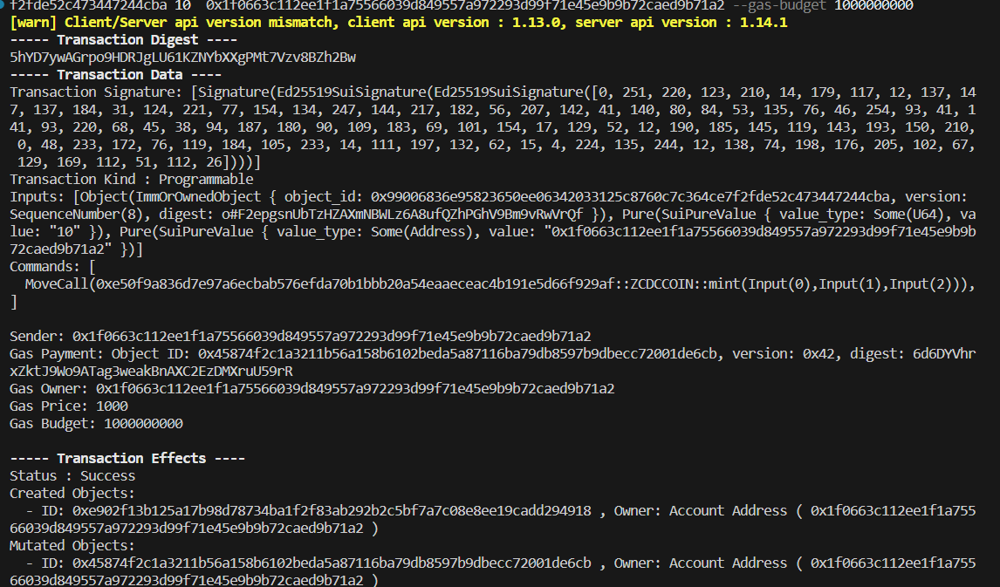
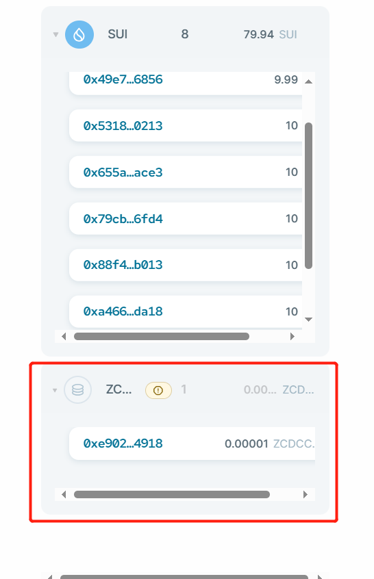
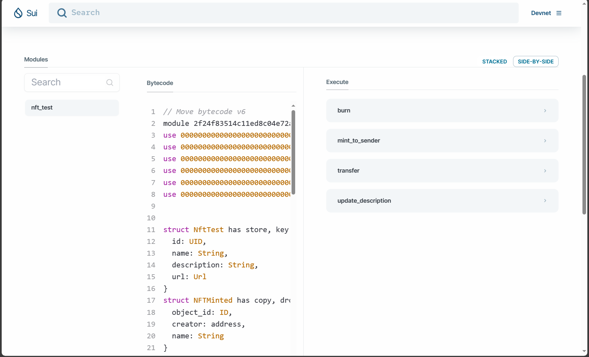
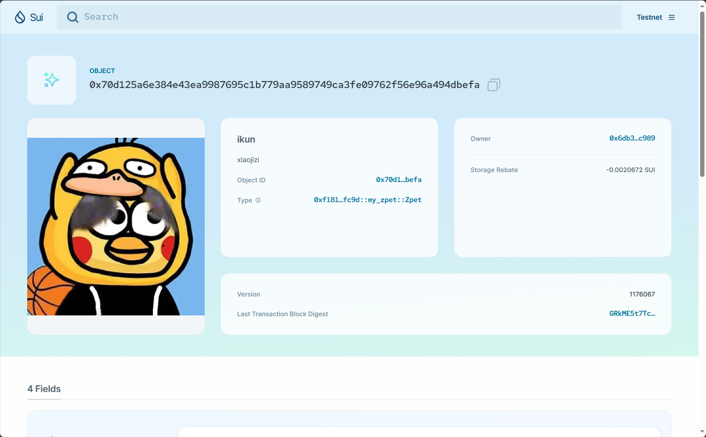

# 学习日志

## 2023-11-10
安装SUI钱包浏览器插件, EDGE浏览器的插件中心里, SUI插件版本存在落后, 需要在Chrome的插件中心安装, 链接为https://chrome.google.com/webstore/detail/sui-wallet/opcgpfmipidbgpenhmajoajpbobppdil/related

可以使用Google账号登录, 获取钱包地址

## 2023-11-11

### 1. windows搭建环境
#### 1) 在https://github.com/MystenLabs/sui/releases中下载windows工具包


#### 2) 解压后配置环境变量, 路径按实际路径配置

`D:\sui-mainnet-v1.13.0-windows-x86_64\external-crates\move\target\release`

`D:\sui-mainnet-v1.13.0-windows-x86_64\target\release`


#### 3) 简化命令
把exe文件名称中`-windows-x86_64`删除


#### 4) 测试命令


### 2. 浏览器插件连接Sui开发链
#### 1) 在Sui浏览器插件中切换到开发链


#### 2) 直接点击按钮即可获取token


### 3. 命令行工具连接Sui开发链
#### 1) 连接
```bash
sui client envs
```

默认则是连接到开发链, 会创建钱包地址和恢复码
```
addr: [0x1f0663c112ee1f1a75566039d849557a972293d99f71e45e9b9b72caed9b71a2]
Secret Recovery Phrase: [grant indicate avocado rail state minimum defense balcony pupil very attend sentence]
```


#### 2) 在浏览器插件里尝试导入
输入前面生成的恢复码


输入密码


可以看到成功导入


#### 3) 请求测试用的tokens
```
curl --location --request POST 'https://faucet.devnet.sui.io/gas' --header 'Content-Type: application/json' --data-raw '{"FixedAmountRequest": {"recipient": "钱包地址"}}'
```

请求一次会获取`10 SUI`


## 2023-11-18

### 1. 智能合约

#### 1. 创建move项目
```
sui move new hello_world
```

#### 2. 在`sources`文件夹中创建`hello.move`

```rust
#[lint_allow(self_transfer)]
module hello_world::hello_world {

    use std::string;
    use sui::object::{Self, UID};
    use sui::transfer;
    use sui::tx_context::{Self, TxContext};

    /// 一个包含一个任意的字符串
    struct HelloWorldObject has key, store {
        id: UID,
        text: string::String
    }

    // 这个函数创建了 HelloWoirldObject 定制类型的一个新实例，然后使用 Sui 系统中的转移函数 transfer 将其发送给交易的调用者
    public fun mint(ctx: &mut TxContext) {
        let object = HelloWorldObject {
            id: object::new(ctx),
            text: string::utf8(b"Hello World!")
        };
        transfer::public_transfer(object, tx_context::sender(ctx));
    }

}
```

#### 3. 构建项目
```
sui move build
```

#### 4. 切换到开发链
```
sui client switch --env devnet
```

添加测试链
```
sui client new-env --alias testnet --rpc https://fullnode.testnet.sui.io:443
```

#### 5. 发布
```
sui client publish --gas-budget 1000000000
```


## 2023-11-19
### 创建一个token coin
```rust
module zcdc_coin::ZCDCCOIN {
    use std::option;
    use sui::coin::{Self, Coin, TreasuryCap};
    use sui::transfer;
    use sui::tx_context::{Self, TxContext};

    struct ZCDCCOIN has drop {}

    /// Module initializer is called once on module publish. A treasury
    /// cap is sent to the publisher, who then controls minting and burning
    fun init(witness: ZCDCCOIN, ctx: &mut TxContext) {
        let (treasury, metadata) = coin::create_currency(witness, 6, b"ZCDCCoin", b"ZCDCCoin", b"ZCDCCoin is NO.1", option::none(), ctx);
        transfer::public_freeze_object(metadata);
        transfer::public_transfer(treasury, tx_context::sender(ctx));
    }

    public entry fun mint (
        treasury_cap: &mut TreasuryCap<ZCDCCOIN>, amount: u64, recipient: address, ctx: &mut TxContext
    ) {
        coin::mint_and_transfer(treasury_cap, amount, recipient, ctx)
    }

    public entry fun burn (
        treasury_cap: &mut TreasuryCap<ZCDCCOIN>, coin: Coin<ZCDCCOIN>
    ) {
        coin::burn(treasury_cap, coin);
    }
}
```

### 获取coin到钱包
```
sui client call --function mint --module ZCDCCOIN --package 0xe50f9a836d7e97a6ecbab576efda70b1bbb20a54eaaeceac4b191e5d66f929af --args 0x99006836e95823650ee06342033125c8760c7c364ce7f2fde52c473447244cba 10  0x1f0663c112ee1f1a75566039d849557a972293d99f71e45e9b9b72caed9b71a2 --gas-budget 1000000000 
```

--module 后面是coin的module名

--package 后面是coin的package


--args 后面第一个参数是coin的id
在自己钱包里找到发布的coin的object id



--args 后面第二个参数 是数量

--args 后面第三个参数 是转到的钱包地址

#### 执行结果



### 创建dapp应用

#### 1. 安装依赖
```
mkdir dapp
cd dapp

pnpm init
pnpm add -D @mysten/sui.js
```

#### 2. 新建`index.js`, 写从开发环境获取sui的程序
```js
import { getFullnodeUrl, SuiClient } from '@mysten/sui.js/client';
import { getFaucetHost, requestSuiFromFaucetV0 } from '@mysten/sui.js/faucet';
import { MIST_PER_SUI } from '@mysten/sui.js/utils';
 
// replace <YOUR_SUI_ADDRESS> with your actual address, which is in the form 0x123...
const MY_ADDRESS = '0x1f0663c112ee1f1a75566039d849557a972293d99f71e45e9b9b72caed9b71a2';
 
// create a new SuiClient object pointing to the network you want to use
const suiClient = new SuiClient({ url: getFullnodeUrl('devnet') });
 
// Convert MIST to Sui
const balance = (balance) => {
	return Number.parseInt(balance.totalBalance) / Number(MIST_PER_SUI);
};
 
// store the JSON representation for the SUI the address owns before using faucet
const suiBefore = await suiClient.getBalance({
	owner: MY_ADDRESS,
});
 
await requestSuiFromFaucetV0({
	// use getFaucetHost to make sure you're using correct faucet address
	// you can also just use the address (see Sui TypeScript SDK Quick Start for values)
    // 获取对应环境的水龙头地址(测试环境, 开发环境, 本地环境)
	host: getFaucetHost('devnet'),
	recipient: MY_ADDRESS,
});
 
// store the JSON representation for the SUI the address owns after using faucet
const suiAfter = await suiClient.getBalance({
	owner: MY_ADDRESS,
});
 
// Output result to console.
console.log(
	`Balance before faucet: ${balance(suiBefore)} SUI. Balance after: ${balance(
		suiAfter,
	)} SUI. Hello, SUI!`,
);
```

### 3. 新建vue3项目, 图形化查询钱包的coins


## 2023-11-22
### 1. 创建nft合约

```rust
module nft::nft_test {
    use sui::url::{Self, Url}
    use std::string;
    use sui::object::{Self, ID, UID};
    use sui::event;
    use sui::tx_context::{Self, TxContext};

    struct NftTest has key, store {
        id: UID,
        name: string::String,
        description: string::String,

    }

    // =======event ==========
    struct NFTMinted has copy, drop {
        object_id: ID,
        creator: address,
        name: string::String,
    }
s
    // 获取名称
    public fun name(nft: &NftTest): &string::String {
        &nft.name
    }

    // 获取描述
    public fun description(nft: &NftTest): &string::String {
        &nft.description
    }

    // 获取链接
    public fun url(nft: &NftTest): &Url {
        &nft.url
    }

    // ========== 入口函数 =======
    // 创建新nft
    public entry fun mint_to_sender (
        name: vector<u8>,
        description: vector<u8>,
        url: vector<u8>,
        ctx: &mut TxContext
    ) {
        let sender = tx_context::sender(ctx);
        let nft = NftTest {
            id: object::new(ctx),
            name: string::uft8(name),
            description: string::uft8(description),
            url: url::new_unsafe_from_bytes(url)
        };
        event::emit(NFTMinted {
            object_id: Object::id(&nft),
            creator: sender,
            name: nft.name
        });

        transfer::public_transfer(nft, sender)
    }

    // 转移nft给新的所有者
    public entry fun transfer(
        nft: NftTest,
        recipient: address,
        _: &mut TxContext
    ) {
        transfer::public_transfer(nft, recipient)
    }

    // 更新nft介绍
    public entry fun update_description(
        nft: &mut NftTest,
        new_description: vector<u8>,
        _: &mut TxContext
    ) {
        nft.description = string::utf8(new_description)
    }

    public entry fun burn(nft: NftTest, _: &mut TxContext) {
        let NftTest {
            id,
            name: _,
            description: _,
            url: _
        } = nft;
        object::delete(id)
    }
}
```

### 2. build
```
sui move build
```

### 3. 发布
```
sui client publish --gas-budget 1000000000
```


https://suiexplorer.com/object/0x2f24f83514c11ed8c04e72a01106c8698fd232bedc485afa834f1fcc7debda8f?network=devnet

### 4. 在页面上触发创建事件


## 20231129
### 1. 安装`sui-move-analysis`
#### 1) 下载windows安装包
https://github.com/movebit/move/releases

#### 2) 配置windows环境变量

#### 3) 配置vscode插件


配置`sui-move-analysis`路径, 注意路径最后去除exe

`D:\\sui-move-analyzer\sui-move-analyzer`

# 20231130
## 1. 命令行里使用zklogin登录谷歌账号
```
sui keytool zk-login-sign-and-execute-tx --max-epoch 999
```

`--max-epoch`设置失效时间

会出现当前所有支持zklogin的平台单点登录地址


登录后会跳转到sui官方地址, 直接复制粘贴到命令行中即可


> 遇到问题: 每次用谷歌的zklogin后 地址都不一样

## 2. 生成带图片nft
主要需要配置`object display`

```rust
module znft::my_zpet {
    use sui::tx_context::{sender, TxContext};
    use std::string::{utf8, String};
    use sui::transfer;
    use sui::object::{Self, ID, UID};
    use sui::event;
    
    use sui::package::{claim};
    use sui::display;

    struct Zpet has key, store {
        id: UID,
        name: String,
        image_url: String,
        description: String
    }

    struct ZPETMinted has copy, drop {
        object_id: ID,
        creator: address,
        name: String,
        image_url: String,
        description: String
    }

    struct MY_ZPET has drop {}

    public fun name(nft: &Zpet): &String {
        &nft.name
    }

    public fun description(nft: &Zpet): &String {
        &nft.description
    }

    public fun image_url(nft: &Zpet): &String {
        &nft.image_url
    }

    fun init (otw: MY_ZPET, ctx: &mut TxContext) {
        let keys = vector[
            utf8(b"name"),
            utf8(b"link"),
            utf8(b"image_url"),
            utf8(b"description"),
            utf8(b"project_url"),
            utf8(b"creator"),
        ];

        let values = vector[
            utf8(b"{name}"),
            utf8(b""),
            utf8(b"{image_url}"),
            utf8(b"{description}"),
            utf8(b""),
            utf8(b"zcdc")
        ];

        let publisher = claim(otw, ctx);

        let display = display::new_with_fields<Zpet>(
            &publisher, keys, values, ctx
        );

        display::update_version(&mut display);

        transfer::public_transfer(publisher, sender(ctx));
        transfer::public_transfer(display, sender(ctx));
    }

    fun create_nft (
        name: String,
        image_url: String,
        description: String,
        ctx: &mut TxContext
    ): Zpet {
        let sender = sender(ctx);
        let id = object::new(ctx);
        let nft = Zpet { id, name, image_url, description };

        event::emit(ZPETMinted {
            object_id: object::id(&nft),
            creator: sender,
            name: nft.name,
            image_url: nft.image_url,
            description: nft.description
        });
        nft
    }


    public entry fun transfer(
        name: String,
        image_url: String,
        description: String,
        recipient: address,
        ctx: &mut TxContext
    ) {
        transfer::public_transfer(create_nft(name, image_url, description, ctx), recipient)
    }

    public entry fun update_description(
        nft: &mut Zpet,
        new_description: vector<u8>,
        _: &mut TxContext
    ) {
        nft.description = utf8(new_description)
    }

    public entry fun burn(nft: Zpet, _: &mut TxContext) {
        let Zpet {
            id,
            name: _,
            image_url: _,
            description: _
        } = nft;
        object::delete(id)
    }
}
```

刚开始是在`mint`的方法里直接`transfer`, 但是会报warning


https://zh.blog.sui.io/linter-compile-warnings-update/

解决方法就是, `mint`的时候不进行`transfer`, 而是在`transfer`的方法里调用`mint`


生成后的nft


## 3. 使用nft storage进行链上存储图片
https://nft.storage/